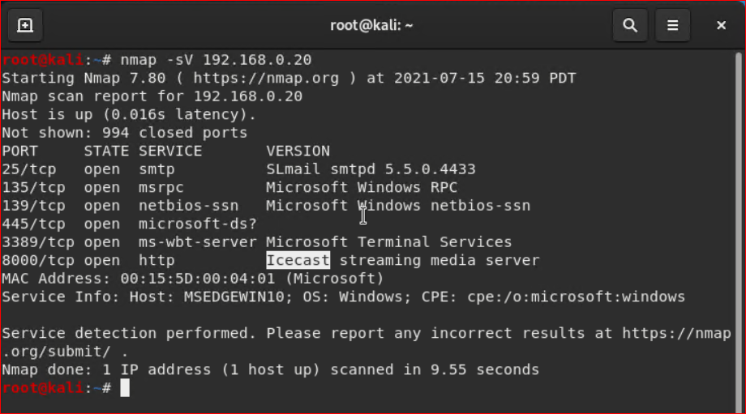

# **GoodSecurity Penetration Report**

## **Kaltun992@GoodSecurity.com**

### **July 14th 2021**

### High-Level Summary

GoodSecurity was tasked with performing an internal penetration test on GoodCorp’s CEO, Hans Gruber. An internal penetration test is a dedicated attack against internally connected systems. The focus of this test is to perform attacks, similar to those of a hacker and attempt to infiltrate Hans’ computer and determine if it is at risk. GoodSecurity’s overall objective was to exploit any vulnerable software and find the secret recipe file on Hans’ computer, while reporting the findings back to GoodCorp.
When performing the internal penetration test, there were several alarming vulnerabilities that were identified on Hans’ desktop. When performing the attacks, GoodSecurity was able to gain access to his machine and find the secret recipe file by exploit two programs that had major vulnerabilities. The details of the attack can be found in the ‘Findings’ category.

### Findings

**Machine IP:**
Machine’s IP address is 192.168.0.20

**Hostname:**
Actual name of the machine *MSEDGEWIN10*

**Vulnerability Exploited:**
The name of the script or Metasploit module used is  *0 exploit/windows/http/icecast_header*

**Vulnerability Explanation:**
it a overflow attack, occurs when more data is put into a fixed-length buffer than the buffer can handle. This overflow usually results in a system crash, but it also creates the opportunity for an attacker to run arbitrary code or manipulate the coding errors to prompt malicious actions in windows platform a buffer overflow in the header parsing of icecast versions 2.0.1 and earlier, it was disclosed 09/28/2004, discovered by Luigi Auriemma.

If the backend is enabled, then any malicious HTTP client can send a request for that specific resource including a crafted header, leading to denial of service and potentially remote code execution.

**Severity:**
In my expert opinion, this vulnerability have **8.1 HIGH** base score as per NIST (NATIONAL VULNERABILITY DATABASE).

**Recommendations:**
A new version of Icecast. It is a security release and we recommend to update all Icecast installations of versions below 2.4.4 to it.

**Proof of Concept:**
This is where you show the steps you took. Show the client how you exploited the software services. Please include screenshots!
After i gain access to the CEO’s computer, been provided access to the network and am getting ping responses from the CEO’s workstation.

1. I Perform a service and version scan using Nmap to determine which services are up and running

1. We see that the Icecast service is running as per above Figure-1 shows, by Searching for Icecast exploits We found which exploits availbale for us and we are used it by attacking that service as per below Figure-2 shows.

1. As per below Figure-3 and Figure-4 demonstrating how the company data is exposed, it can be downloaded by unauthorized users

1. We run a another scan to find all the other vulnerabilities, and we documented it below:

- the as CEO's workstation has multiple possible vulnerabilities as per below Figure-5 shows.

**Vulnerability Exploited:**
The name of the script or Metasploit module found is *exploit/windows/local/ikeext_service*

**Vulnerability Explanation:**

This module exploits a missing DLL loaded by the 'IKE and AuthIP Keyring Modules' (IKEEXT) service which runs as SYSTEM, and starts automatically in default installations of Vista-Win8 SP1, Windows Server 2008 SP2, Windows 7 SP1, and Windows 8 Release Preview. It requires an **insecure bin path** to plant the DLL payload.
A DLL error is the most common Windows error. DLL stands for Dynamic Link Library. Essentially, a DLL file is a necessary component of a particular program or application. Without that DLL file, the program or application cannot run properly.

**Severity:**

In my expert opinion, this vulnerability have **6.0 MEDIUM** base score as per NIST (NATIONAL VULNERABILITY DATABASE).
[Refernce:](https://nvd.nist.gov/vuln/detail/CVE-2012-5378)

**Recommendations:**

This post shows us how easily elevated privileges can be achieved with very little effort. Ultimately the solution is simple by just making sure all software gets installed in the C:\Program Files folder which will then inherent it’s more secure folder permissions. Malware could take advantage of this weakness not only to obtain system privileges but also to automatically load its malware making it that much harder to pinpoint its auto start entry points.
[Refernce:](https://www.greyhathacker.net/?p=738)

**Vulnerability Exploited:**
The name of the script or Metasploit module found is *exploit/windows/local/ms16_075_reflection*

**Vulnerability Explanation:**

Microsoft Remote Procedure Call, also known as a function call or a subroutine call, is a protocol that uses the client-server model in order to allow one program to request service from a program on another computer without having to understand the details of that computer's network.
Remote Procedure Call (RPC) is a protocol used by the Windows operating system. This particular vulnerability affects a Distributed Component Object Model (DCOM) interface with RPC, which listens on RPC enabled ports. This interface handles DCOM object activation requests that are sent by client machines to the server.
DCOM is an acronym that stands for Distributed Component Object Model. It is Microsoft's solution for distributed computing. It allows one client application to remotely start a DCOM server object on another machine and invoke its methods. So, functionally it is similar to CORBA and RMI.
DCOM can also work on a network within an enterprise or on other networks besides the public Internet. It uses TCP/IP and Hypertext Transfer Protocol . DCOM comes as part of the Windows operating systems. DCOM is or soon will be available on all major UNIX platforms and on IBM's large server products.
Module utilizes the Net-NTLMv2 reflection between DCOM/RPC to achieve a SYSTEM handle for elevation of privilege. Currently the module does not spawn as SYSTEM, however once achieving a shell, one can easily use incognito to impersonate the token.

**Severity:**

**Recommendations:**
